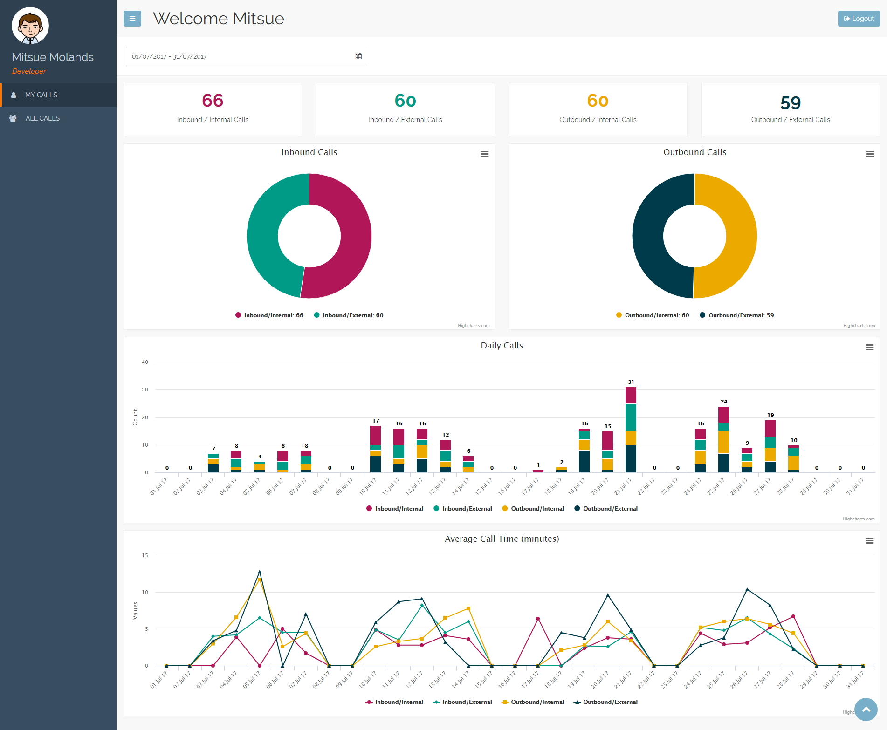
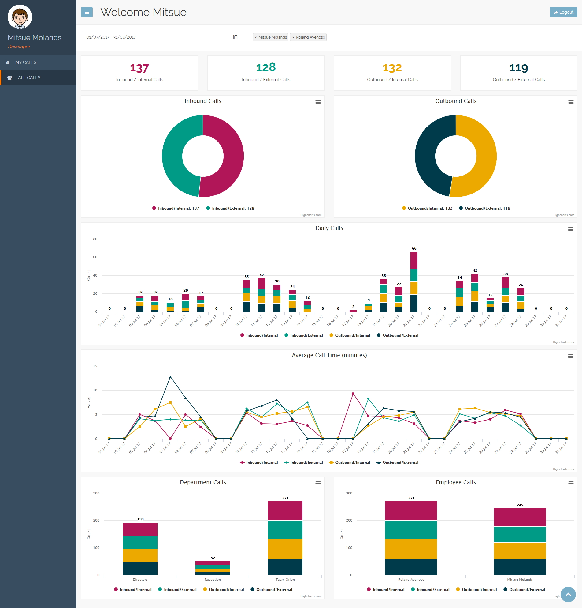
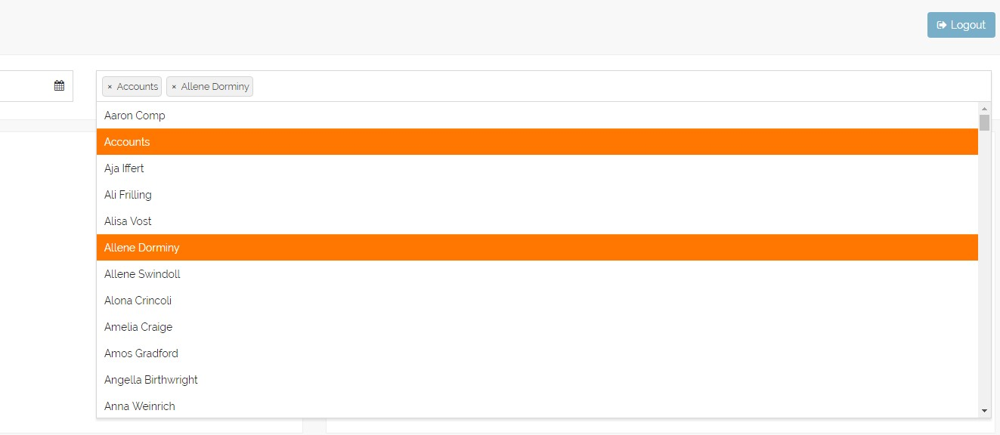
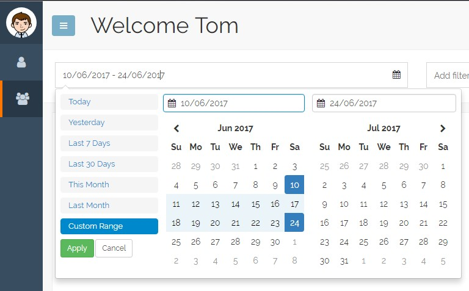

Phone Reporting System
======================

This is an experimental project that I've been working on that replicates a real world scenario. 

The application is a reporting dashboard, behind a login, that displays various company call statistics made by departments and employees. In the real world scenario the calls would be imported from a phone system's database, but in my applicaiton I've created a replica of this database, which I've populated it with sample data.

All statistics have been charted using the [HighCharts JS] library.


Phone Database
--------------
To create the sample phone database, open up a PostgreSQL shell and execute the following commands:

```
psql
CREATE USER [username] WITH PASSWORD '[password]';
CREATE DATABASE [dbname] WITH OWNER [username];
ALTER USER [username] WITH SUPERUSER;
```

The simple schema can then be created by running the SQL commands found in the [create-commands.sql] file

This database can then be populated with sample data by adapting and running the [populate\_db.py] script.


Django Database
---------------
The Django database is created in the same way:

``` 
psql
CREATE USER [username] WITH PASSWORD '[password]';
CREATE DATABASE [dbname] WITH OWNER [username];
ALTER USER [username] WITH SUPERUSER;
```

With these details entered into the Django settings accordingly.

Application
-----------
The finished appication has two pages, the first displays "my calls" for the authenticated user.



The second displays "all calls" made by the company, which has an additional filter bar.



The filter bar has been implemented using the [Fast Select] library.



I've also used the [Date Range Picker] for selecting date ranges.




NOTES
-----

A few general notes for now, regarding the calls in the database:

``` 
ch_internal_external = 0   /* internal */ 
ch_internal_external = 1   /* external */ 

ch_direction = 0    /* inbound */ 
ch_direction = 1    /* outbound */ 
```

  [create-commands.sql]: configuration/db/create-commands.sql
  [populate\_db.py]: configuration/db/populate_db.py
  [HighCharts JS]: https://www.highcharts.com/
  [Fast Select]: http://dbrekalo.github.io/fastselect/
  [Date Range Picker]: http://www.daterangepicker.com/
